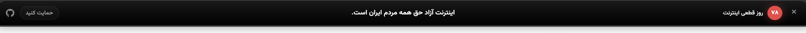
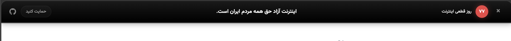
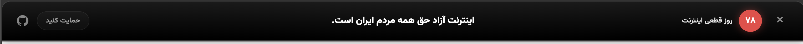

# 🚫  اینترنت آزاد حق همه مردم ایران است

<div dir="rtl">
با اضافه کردن یک خط کد به وب‌سایت خود، صدای مردم در روزهای سیاهی و سختی دیجیتال باشید.

## نمونه







(متن و اندازه قابل تغییر است)

## چرا؟


اینترنت طبقاتی (پرو) رشد و پیشرفت را در انحصار گروه‌های خاص (پردرآمدها، سیاستمداران، دانشگاهیان و...) می‌کند تا از طریق منافع فکری،‌اقتصادی و سیاسی اقلیت‌های خاص را حفظ کند.

هدف اینترنت طبقاتی امنیت است اما امنیت همان گروه‌های خاص: گروه‌هایی که سال‌هاست به نام صیانت، به نام اقتصاد و حاکمیت مجازی و امروز به نام امنیت به دنبال قطعی و محدودسازی اینترنت هستند. چرا که با اینترنت محدود راحت‌تر می‌شود توده‌های مردم را کنترل کرد و جلوی صداهای متفاوت و ایده‌های تازه را گرفت.

---

##  شروع سریع

کافیست کد زیر را بعد تگ `<body>` وب‌سایت خود قرار دهید:

```html
<script src="https://unpkg.com/iran-net-protest-banner@latest/protest.js"></script>
```

> [!TIP]
> با توجه به احتمال بسته شدن سرویس‌های باز فعلی بهتر است فایل protest.js را به صورت دستی در وب سایت خود قرار داده و سپس آدرس آنرا در کد بالا جایگزین کنید. البته در صورتی که فنی نیستید بهتر است از همان کد بالا استفاده کنید.
---

## 🛠 تغییر متن اعتراضی و اندازه 

شما می‌توانید رفتار و ظاهر اسکریپت را با استفاده از پارامترهای زیر  تغییر دهید مثال‌های پایین را ببینید.

| پارامتر | توضیحات | مقادیر ممکن | پیش‌فرض |
| :--- | :--- | :--- | :--- |
| `size` | اندازه نوار ابزار کوچک، متوسط یا بزرگ | `sm`, `md`, `lg` | `md` |
| `countdown` | نمایش یا عدم نمایش تعداد روزهای قطعی | `true`, `false` | `true` |
| `text` | متن پیام اعتراضی | هر متن دلخواه |اینترنت آزاد حق همه مردم ایران است   |

### 📝 مثال‌ها

#### ۱. حالت مینیمال (کوچک و ساده)
```html
<script src="{YOUR_ADDRESS_HERE}/protest.js?size=sm&countdown=false"></script>
```

#### ۲. بنر بزرگ با پیام اختصاصی
```html
<script src="{YOUR_ADDRESS_HERE}/protest.js?size=lg&text=اینترنت_حق_پایه_انسانی_است"></script>
```

#### ۳. استفاده در سایت‌های انگلیسی‌زبان
```html
<script src="{YOUR_ADDRESS_HERE}/protest.js?text=Internet_Access_is_a_Right"></script>
```

---

## 💻 اجرای محلی (برای افراد فنی)

اگر می‌خواهید تغییراتی در اسکریپت ایجاد کنید یا آن را تست کنید:

۱. مخزن را کلون کنید:
```bash
git clone https://github.com/[YOUR_USERNAME]/net.git
```

۲. یک سرور محلی اجرا کنید:
```bash
npx serve .
```

---

## 🤝 مشارکت

 از هرگونه مشارکت برای بهبود این ابزار استقبال می‌کنیم! 
- اگر باگی پیدا کردید، یک **Issue** ثبت کنید.
- اگر پیشنهادی دارید، **Pull Request** بفرستید.

---

## 📜 مجوز

این پروژه تحت لایسنس **MIT** منتشر شده است. استفاده از آن برای اهداف خیرخواهانه و آگاهی‌رسانی کاملاً آزاد است.

---

<p align="center">
  <b>#InternetFreedom #IranNetShutdown #FreedomOfSpeech #آزادی_اینترنت</b>
</p>


</div>
